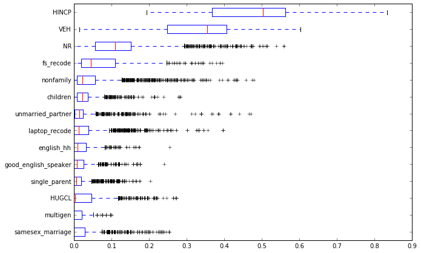
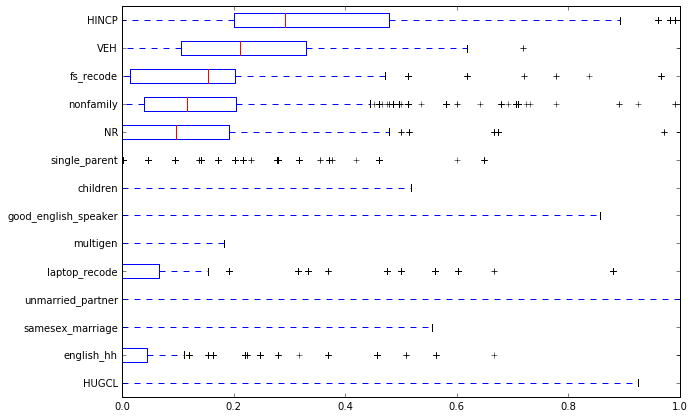
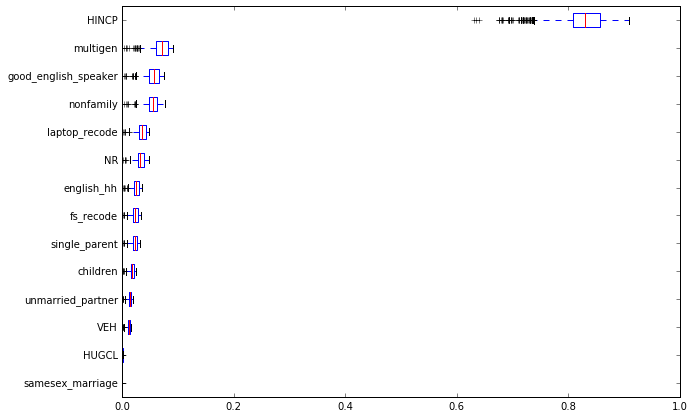
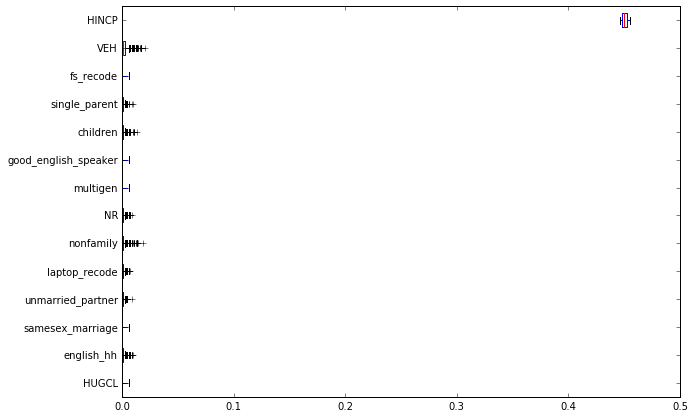
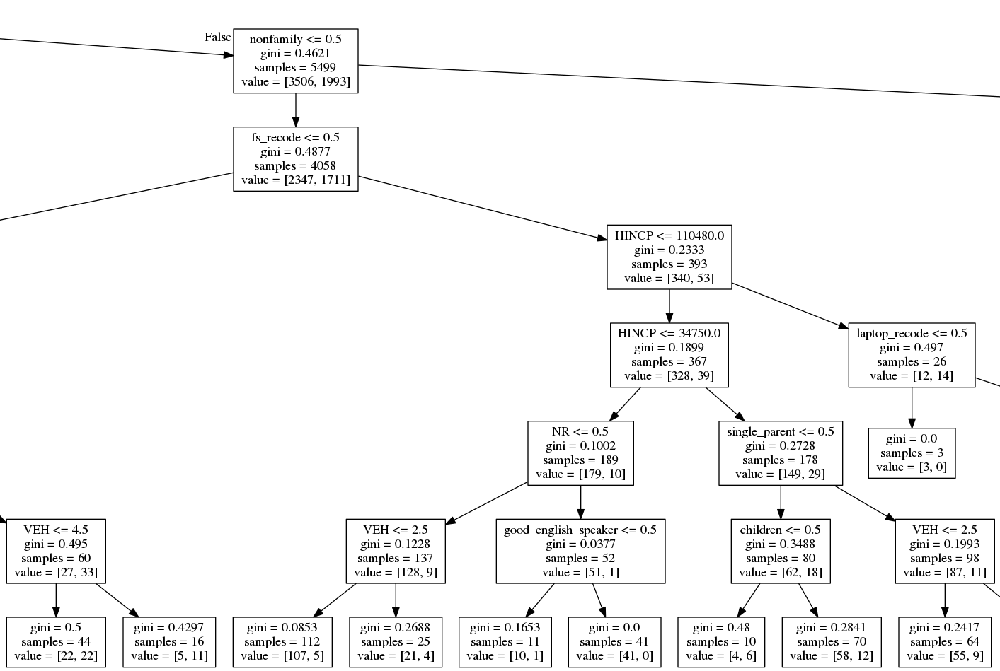

# Predicting Household Behavior using Census Data

*Analysis of the accuracy, sensitivity, and interpretability of various classification algorithms
in predicting household tenure (renting vs. owning) using Census PUMS data.*

*Civil & Environmental Engineering 263n: Scalable Spatial Analytics at UC-Berkeley
Paul Sohn, December 11, 2016*

## Introduction

As a data scientist for UrbanSim, I am interested in methods to accurately
and reliably predict household behavior. One of the household behaviors that
cities and regions may be most interested in predicting is tenure: whether
households choose to rent or own their units. This is one of several "choices" in the
sequence of UrbanSim models where a method for classification is needed,
such as the decision of what type of building to live in, what location to select.

Logit models (binary logit, multinomial logit) are the classification method of
 choice at this time. Given the much larger array of accessible classification algorithms
  that are available today, though, I am interested in exploring how the current
  implementation of logit models stacked in up performance against a range of other
  classifiers, all of which are available in the scikit-learn library. This project
  therefore aimed to evaluate selected classifiers from scikit-learn along the following
  dimensions:

  * Accuracy: For what proportion of test cases does a trained classifier correctly predict tenure?
  * Sensitivity: How much do changes in features (variables) affect classifier results?
  * Interpretability: How easy is it to interpret classifier parameters and why a classifier
  predicts a certain outcome for a given case?

## Data

For this project, I used Public Use Microdata Sample (PUMS) data from the U.S. Census Bureau.
This is a publicly available, disaggregate data source that provides records for individual
persons and housing units. Information about renting and owning is available in the housing
unit records of PUMS; I used the 2015 one-year sample data for California for this project.
There were 155,218 records to begin with. Data were cleaned to remove records for
institutional or non-institutional group quarters, so as to focus only on housing units.
The dataset was also filtered to include only housing units for which the occupant(s)
moved in 12 months ago or more recently. Focusing on recent movers was important for this
analysis, since these households are likeliest to have characteristics similar to when they
actually chose to rent or own their housing unit. The two steps above yielded a dataset of
15,928 records.

There are more than 150 variables in the housing unit record, but I chose to focus on a
 small subset that seemed applicable to the tenure decision. These include variables
 related to the *housing unit* itself, like the number of rooms or access to the internet,
 as well as variables related to the *household*, such as income or number of vehicles.
 It is important to distinguish between these types because while housing characteristics
 are available in this dataset, we would not use them for predicting tenure decisions, since
 they are specific to a housing unit and not the broader decision of whether to rent or buy. 
 In the theory of this model in the UrbanSim context, households choose their tenure before
 deciding on a location. Nevertheless, we keep both types of variables in order to test 
 their performance. The full list of variables is presented in Table 1.


Table 1: Variables used from the PUMS Housing Unit record

| Variable | Description                                                            | Type      |
|----------|------------------------------------------------------------------------|-----------|
| ACCESS   | Access to the Internet                                                 | Housing   |
| BATH     | Bathtub or shower                                                      | Housing   |
| RMSP     | Number of rooms                                                        | Housing   |
| YBL      | When structure first built                                             | Housing   |
| KIT      | Complete kitchen facilities                                            | Housing   |
| FS       | Yearly food stamp/Supplemental Nutrition Assistance Program recipiency | Household |
| LAPTOP   | Laptop, desktop, or notebook computer                                  | Household |
| VEH      | Vehicles (1 ton or less) available                                     | Household |
| HHL      | Household language                                                     | Household |
| HHT      | Household/family type (e.g. married couple, nonfamily)                 | Household |
| HINCP    | Household income (past 12 months)                                      | Household |
| HUGCL    | Household with grandparent living with grandchildren                   | Household |
| HUPAC    | HH presence and age of children                                        | Household |
| LNGI     | Limited English speaking household                                     | Household |
| MULTG    | Multigenerational Household                                            | Household |
| NR       | Presence of nonrelative in household                                   | Household |
| PARTNER  | Unmarried partner household                                            | Household |
| SSMC     | Same-sex married couple households                                     | Household |

Many of these are numerically coded nominal variables, with integer values representing 
different categories; the household language variable is a good example, with "1" 
representating "English only,"2" representing "Spanish," etc. When using many methods such as 
linear or logistic regression, it is important to recode these types of variables to 
dummy variables or other types that have a meaningful numeric coding, while making sure
to leave one category out. Other methods like decision trees handle categorical variables
 well and do not require such recoding. I created recoded versions of many of these variables,
  shown in Table 2.

Table 2: Recoded variables 

| Original variable | Recoded variable     | Description of recoding                                                     |
|-------------------|----------------------|-----------------------------------------------------------------------------|
| ACCESS            | access_recode        | Convert from [1,2] to [1,0] coding                                          |
| BATH              | bath_recode          | Convert from [1,2] to [1,0] coding                                          |
| YBL               | before1990           | Convert to dummy variable with 1 for units built before 1990                |
| KIT               | kit_recode           | Convert from [1,2] to [1,0] coding                                          |
| FS                | fs_recode            | Convert from [1,2] to [1,0] coding                                          |
| LAPTOP            | laptop_recode        | Convert from [1,2] to [1,0] coding                                          |
| HHL               | english_hh           | Convert to dummy variable with 1 for households that are English-speaking   |
| HHT               | single_parent        | Convert to dummy variable with 1 for family households with a single parent |
| HHT               | nonfamily            | Convert to dummy variable with 1 for non-family households                  |
| HUPAC             | children             | Convert to dummy variable with 1 for households with children               |
| LNGI              | good_eng_speaker     | Convert from [1,2] to [1,0] coding                                          |
| MULTG             | multigen             | Convert from [1,2] to [1,0] coding                                          |
| PARTNER           | unmarried_partner    | Convert from [1,2] to [1,0] coding                                          |
| SSMC              | samesex_marriage     | Convert from [1,2] to [1,0] coding                                          |

Between variable types (housing vs. household) and recoding statuses (original vs. recoded),
four separate datasets were created:

* Original variables: housing and household variables 
* Original variables: household variables only
* Recoded variables: housing and household variables
* Recoded variables: household variables only

The `data_preparation.py` module performs each of the steps described above.

## Classifiers

I selected several classifiers available in the scikit-learn library to test against 
the logit classifier that the current UrbanSim stack uses. Instead of using the 
custom implementation of multinomial and binary logit that exists in the UrbanSim 
library, I used the scikit-learn logistic regression classifier for simplicity and 
comparability. Logistic regression and logit classification are essentially identical
methodologies for the purposes of this evaluation.

The classifiers I selected for this project are:

* Decision trees (scikit-learn estimator `DecisionTreeClassifier`)
* Random forests (`RandomForestClassifier`)
* Linear support vector machine (`LinearSVC`)
* K-nearest neighbors (`KNeighborsClassifier`)
* Logistic regression (`LogisticRegression`)

## Hyperparameter Tuning

Because some classifiers can yield substantially different accuracy results with different
values of hyperparameters, I performed a randomized grid search on selected parameters using
the scikit-learn `RandomizedSearchCV` function, which tests random combinations of parameters
and returns the sets with the highest cross-validation accuracy score. I used the 
household only recoded dataset for this grid search. 
 Table 3 shows parameters I tested for and the final parameters found for each. Note that 
 I used the same parameter ranges for Decision Tree and Random Forests classifiers. The final value 
 was only slightly different between the two; Random Forests had a `max_features` value of 
 9; the Decision Tree classifier had a value of 7. 

Table 3: Hyperparameter tuning

| Classifier           | Parameter         | Distribution               | Final Value |
|----------------------|-------------------|----------------------------|-------------|
| Tree Classifiers     | max_depth         | randint(2, 10)             | 7           |
| Tree Classifiers     | max_features      | randint(1, 11)             | 9 / 7       |
| Tree Classifiers     | min_samples_split | randint(1, 11)             | 2           |
| Tree Classifiers     | min_samples_leaf  | randint(1, 11)             | 2           |
| Tree Classifiers     | criterion         | ["gini", "entropy"]        | gini        |
| LinearSVC            | C                 | np.linspace(0.1, 2, 20)    | 1.4         |
| LinearSVC            | loss              | ['hinge', 'squared_hinge'] | hinge       |
| KNeighborsClassifier | n_neighbors       | randint(1, 1000)           | 813         |
| KNeighborsClassifier | weights           | ['uniform', 'distance']    | uniform     |
| KNeighborsClassifier | algorithm         | ['ball_tree', 'kd_tree']   | ball_tree   |
| KNeighborsClassifier | leaf_size         | randint(10, 100)           | 58          |
| KNeighborsClassifier | p                 | [1, 2]                     | 1           |


## Evaluation: Accuracy

The first and most important criterion for evaluating these classifiers is the accuracy 
of predictions. The specific metric I used is mean accuracy from five-fold cross 
validation, using the `cross_val_score` function from scikit-learn's metrics library.
This built-in function takes scikit-learn estimators, along with a training dataset,
and performs k-fold cross validation and returns a selected metric for all *k* folds.

I iterated through all four datasets above, along with tuned classifiers, and took the 
mean cross-validation score. Results are presented below in Table 4.

Table 4: Accuracy results for five classifiers on four datasets

| Variable Set          | Recoding Status | Classifier             | Mean Accuracy |
|-----------------------|-----------------|------------------------|---------------|
| Housing and Household | Not recoded     | RandomForestClassifier | 79.44%        |
| Housing and Household | Not recoded     | DecisionTreeClassifier | 78.26%        |
| Housing and Household | Not recoded     | LogisticRegressionCV   | 76.10%        |
| Housing and Household | Not recoded     | KNeighborsClassifier   | 74.76%        |
| Housing and Household | Not recoded     | LinearSVC              | 74.33%        |
|-----------------------|-----------------|------------------------|---------------|
| Housing and Household | Recoded         | RandomForestClassifier | 79.27%        |
| Housing and Household | Recoded         | DecisionTreeClassifier | 78.05%        |
| Housing and Household | Recoded         | KNeighborsClassifier   | 74.79%        |
| Housing and Household | Recoded         | LogisticRegressionCV   | 74.44%        |
| Housing and Household | Recoded         | LinearSVC              | 67.75%        |
|-----------------------|-----------------|------------------------|---------------|
| Household only        | Not recoded     | RandomForestClassifier | 76.79%        |
| Household only        | Not recoded     | DecisionTreeClassifier | 75.96%        |
| Household only        | Not recoded     | LogisticRegressionCV   | 75.29%        |
| Household only        | Not recoded     | KNeighborsClassifier   | 74.68%        |
| Household only        | Not recoded     | LinearSVC              | 73.35%        |
|-----------------------|-----------------|------------------------|---------------|
| Household only        | Recoded         | RandomForestClassifier | 76.82%        |
| Household only        | Recoded         | DecisionTreeClassifier | 76.40%        |
| Household only        | Recoded         | KNeighborsClassifier   | 74.77%        |
| Household only        | Recoded         | LogisticRegressionCV   | 74.42%        |
| Household only        | Recoded         | LinearSVC              | 71.21%        |

The best results across all datasets are are produced by the Random Forests
estimator, with the Decision Tree classifier coming in second for each dataset. It's not 
surprising that the ensemble method outperforms the basic decision tree estimator,
but it is interesting to note that tree-based methods are most accurate.
Logistic Regression and K Nearest Neighbors Classifier have similar results, and 
Linear SVC comes in last place on each dataset. Note that I only tested the
linear kernel of the support vector machine classifier; non-linear methods were
not tested because fitting those algorithms is typically very slow relative to 
other methods. For the rest of this report, I will not evaluate the SVC classifier.

## Evaluation: Sensitivity

It is also helpful to better understand how sensitive each of the models are to various features.
For example, how sensitive is the rent vs. own decision to household income in each of the models?
For this evaluation, I made use of the open source [ML Insights](https://github.com/numeristical/introspective)
library, which provides functionality "to see how [a given] model performs when one feature is changed, 
holding everything else constant." I was hoping to see two things in each model: first, that it was 
sensitive to changes in important variables, particularly income and vehicle ownership, and second, 
that there was consistency in sensitivity; in other words, if a model is sensitive to a variable, 
it is similarly sensitive across many changes.

I created a training set with 70% of the data from the household only recoded dataset, 
and tested sensitivity using the 30% testing dataset. The primary tool I used for interpreting
sensitivity was the Feature Effect Summary method from the ML Insights `ModelXRay` class.
This provides a boxplot to summarize the extent to which probabilities for given 
cases tend to change when each variable is adjusted within its empirical range. We'll start 
here with the Feature Effect Summary for the Random Forest Classifier (Figure 1):



Results in the boxplots are sorted by median effect in changing probabilities.
The Random Forest classifier is highly sensitive to changes in a few of the variables,
 with household income and number of vehicles being the most important. These results
 make intuitive sense, particularly the idea that income is the variable that 
 models should be most sensitive to. There is also some variability in 
 the sensitivity of the model to key variables. Changes in most variables 
 appear to make little difference to results. This includes whether the household has 
 children or whether it is a single parent household.



The Decision Tree summary (Figure 2) shows sensitivity to a similar set of variables,
but with much less consistency; the boxplots are very wide, meaning that there is 
large variability in the extent to which changes in a given variable effect 
model results. This makes sense in comparison to the Random Forests results, 
given that Random Forests takes an average of results from Decision Tree models,
reducing variability. Results for Logistic Regression (Figure 3) are dominated by household income
to a greater extent than the tree-based results, and shows consistency in sensitivity.
 Strangely, this model is not sensitive to number of vehicles, 
 which is the second most important variable for the two decision tree related models (and 
 one that I expected to be important). Finally, the nearest neighbors classifier shows 
almost no sensitivity to most variables other than household income.





The Random Forests model showed sensitivity to different variables in a pattern that
is most similar to expectations, but had substantial variability. Logistic regression
provided consistent results, but was not sensitive to vehicle ownership, which was
surprising.

\pagebreak

## Evaluation: Interpretability

The final criterion is interpretability. Logistic regression/logit models are a good 
starting place for this discussion; as linear regression models, their formulations 
are familiar and easily interpretable. For our fitted logistic regression classifier
in scikit-learn, we can output estimated coefficients and format them as a familir 
regression equation or random utility equation as below. 
This allows us to, for instance, calculate odds ratios or
 tradeoffs between different variables, and gives us a sense of the importance of 
 different variables (given the units of variables are known).

```
Utility = B_0 + -0.137489 * fs_recode + -0.197245 * laptop_recode + 0.011107 * VEH + 
-0.143870 * english_hh + -0.131076 * single_parent + -0.310259 * nonfamily + 
0.000006 * HINCP + -0.004984 * HUGCL + -0.103327 * children + 
-0.301032 * good_english_speaker + -0.367452 * multigen + 
-0.190938 * NR + -0.081423 * unmarried_partner + 0.000830 * samesex_marriage
``` 

Machine learning models are often thought of as black-box models because of the
difficulty of interpreting them. Decision tree models are sometimes thought of this way,
though visualization techniques can help illuminate what's going on under the hood of these models.
The scikit-learn library includes functionality to output decision tree rules as a GraphViz dot file,
which can be converted to an image. This provides a visual tree that can help understand how results 
break down. A small section of our trained Decision Tree classifier is visualized in Figure 5. 



A Random Forests model can be visualized in a similar way, using one sub-estimator at a time,
but this is difficult to decipher and does not provide a quick way to visually or intuitively 
interpret the model. The interpretability of both Decision Trees and Random Forests is also 
subject to the tree depth as well: the deeper the tree, the more difficult to interpret. Finally,
nearest neighbor models are also difficult to interpret and provide no quick, intuitive visual summary of 
model structure, at least beyond very small dimensions. In some ways, while the idea of nearest 
neighbors is very simple, it is the least interpretable model I evaluated.  

## Conclusion

Decision Trees and their ensemble version, Random Forests, provide a potentially promising alternative 
to logit modeling for classification problems in the UrbanSim model ecosystem. They are more accurate in 
their predictions than logistic regression, at least on the California PUMS dataset, if by only 
a small percentage. Random Forest models also provide the sensitivity to different variables that 
is closest to my personal expectation, but fall short in their interpretability.
 This analysis is only a start, though, and these three evaluations should be revisited in a more 
 thorough analysis. There are other major improvements that could be made to this analysis, 
 including using more sophisticated methods for feature selection, testing more classifiers, 
 and performing a more expansive grid search for hyperparameters. As it stands, interpretability 
 seems to be the least important criterion for implementing an alternative classifier in UrbanSim. 
 Therefore, Random Forests emerges as the best possibility for an alternate method for predicting tenure. 